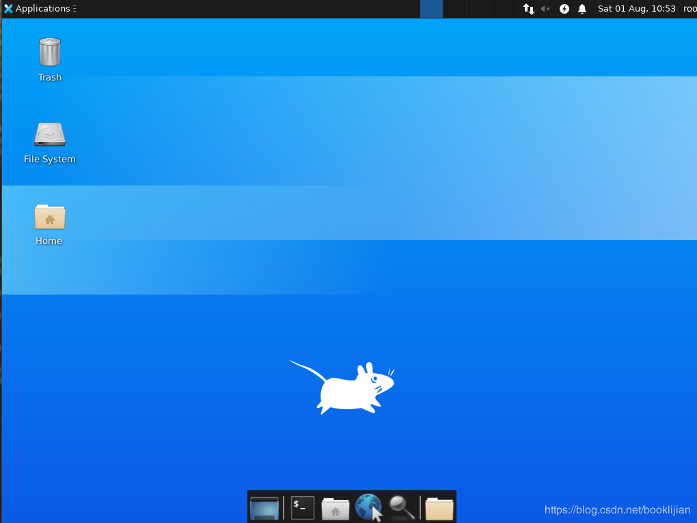
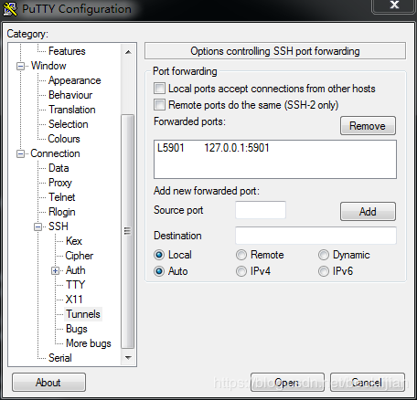

# Ubuntu 20.04系统中安装vncserver的方法步骤 #

Ubuntu 20.04已经在2020年4月份正式发布，笔者今天正式安装了一个镜像系统，并在该系统中安装vncserver以便于远程图形化管理和使用。安装vncserver的步骤如下：

第一步：安装桌面环境和VNCServer

```
#更新
apt update
#安装桌面环境
sudo apt install xfce4 xfce4-goodies
#安装vncserver
apt install tightvncserver
#启动vncserver
vncserver
```

随后按照提示，输入vncserver登录时候的密码并再次输入确认。

从远程登录之后发现桌面一片灰白。看来还需要配置一下vncserver的环境：

第二步：配置vncserver的参数

```
#关闭vncserver ：1窗口
vncserver -kill :1
#备份原来的配置文件
mv ~/.vnc/xstartup ~/.vnc/xstartup.bak
#编辑新的配置文件
vim ~/.vnc/xstartup
```

在xstartup文件中更新为如下内容：

```
#!/bin/bash
xrdb $HOME/.Xresources
startxfce4 &
```

然后设置该文档的权限


	chmod +x ~/.vnc/xstartup

随后重新启动vncserver即可连接图像界面，截图如下：



可以看到已经能够出现图形界面。但是目前是不安全的连接方式，如果需要考虑安全性，仍然需要进一步的配置。

在远程主机终端输入：


	ssh -L 59000:localhost:5901 -C -N -l root server_ip

其中server_ip替换为您的远程主机IP地址即可

然后使用putty，其他设置与普通的ssh设置类似，只是需要设置ssh隧道，具体设置如下图所示：



在source port 中输入5901，destination输入 127.0.0.1:5901，然后点击Add按钮，即可添加入上图所示的效果。

随后首先在本地用ssh登录远程主机，然后再vncviewer等客户端中输入 127.0.0.1:1即可实现登录。

原文链接：https://www.jb51.net/article/194081.htm