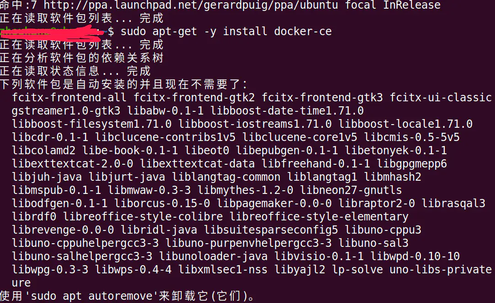
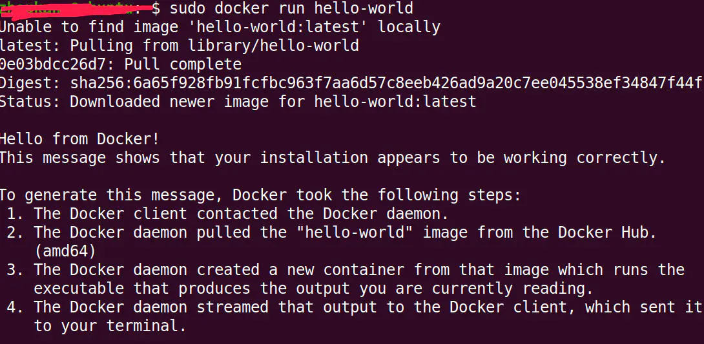
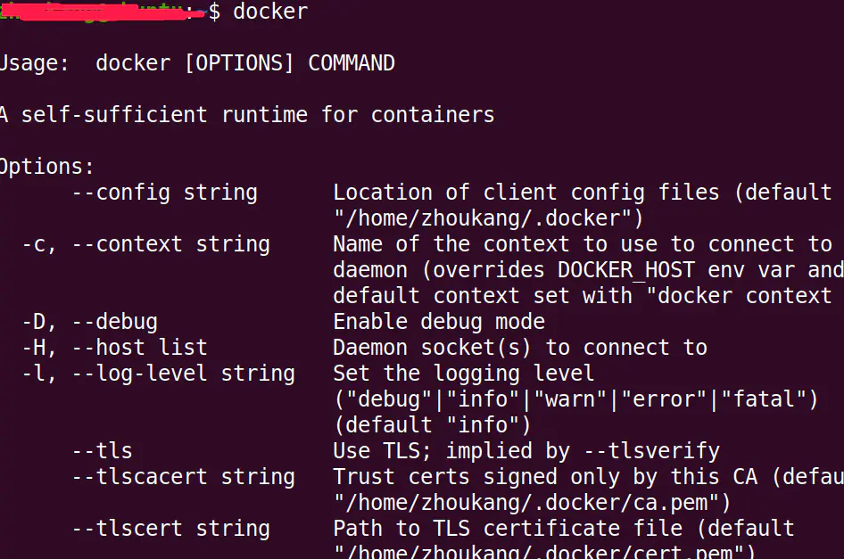

# Ubuntu20.04成功安装Docker #

我使用的是阿里云源安装的，具体操作如下

在终端输入以下命令：

```
#使用 apt-get 进行安装
# step 1: 安装必要的一些系统工具
sudo apt-get update
sudo apt-get -y install apt-transport-https ca-certificates curl software-properties-common
# step 2: 安装GPG证书
curl -fsSL https://mirrors.aliyun.com/docker-ce/linux/ubuntu/gpg | sudo apt-key add -
# Step 3: 写入软件源信息
sudo add-apt-repository "deb [arch=amd64] https://mirrors.aliyun.com/docker-ce/linux/ubuntu $(lsb_release -cs) stable"
# Step 4: 更新并安装Docker-CE
sudo apt-get -y update
sudo apt-get -y install docker-ce
 
# 安装指定版本的Docker-CE:
# Step 1: 查找Docker-CE的版本:
# apt-cache madison docker-ce
#   docker-ce | 17.03.1~ce-0~ubuntu-xenial | https://mirrors.aliyun.com/docker-ce/linux/ubuntu xenial/stable amd64 Packages
#   docker-ce | 17.03.0~ce-0~ubuntu-xenial | https://mirrors.aliyun.com/docker-ce/linux/ubuntu xenial/stable amd64 Packages
# Step 2: 安装指定版本的Docker-CE: (VERSION例如上面的17.03.1~ce-0~ubuntu-xenial)
# sudo apt-get -y install docker-ce=[VERSION]
```


深度截图_选择区域_20200520192048.png

输入以下命令验证是否安装成功：

	sudo docker run hello-world

执行


深度截图_选择区域_20200520192552.png

说明安装成功


深度截图_选择区域_20200520192953.png

[参考文献](https://links.jianshu.com/go?to=https%3A%2F%2Fdeveloper.aliyun.com%2Fmirror%2Fdocker-ce)

作者：地球上的人类KangSmith
链接：https://www.jianshu.com/p/da1c7dc4217a
来源：简书
著作权归作者所有。商业转载请联系作者获得授权，非商业转载请注明出处。